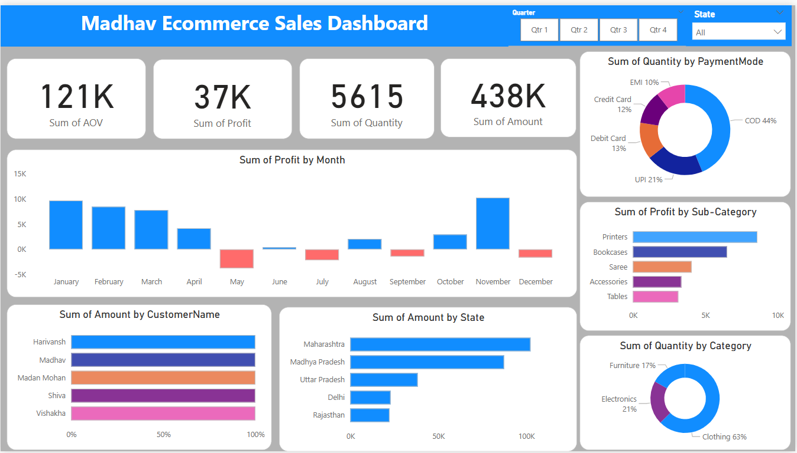

# Online Sales Dashboard – Power BI Project

## Project Objective
The goal of this project was to analyze online sales data across customers, cities, product categories, and payment modes — and to create an interactive dashboard that makes it easy to draw insights.

## Dataset Used: 
[**Order Details**](https://github.com/radhasiingh/Power-BI-Project-1/blob/main/Details.csv)\
[Customer details](https://github.com/radhasiingh/Power-BI-Project-1/blob/main/Orders.csv)

## Business Problems (KPIs) & Insights from the Madhav Ecommerce Dashboard

### 1. What are the total sales, profits, and order volumes?
Total Sales (Amount): ₹438K\
Total Profit: ₹37K\
Total Quantity Sold: 5615 units\
Average Order Value (AOV): ₹121K2.
  
### 2. Which states and cities contribute the highest sales and revenue?
Top States:
- Maharashtra
- Madhya Pradesh
- Uttar Pradesh
These three states account for the majority of total revenue.

### 3. Which product categories and sub-categories are top performers?
- Top Category by Quantity Sold:
  - Clothing (63%)
- Top Sub-Categories by Profit:
  - Printers
  - Bookcases
    
### 4. How does monthly profit trend throughout the year?
- Highest Profits:
  - January, February, and November
- Profit Dips:
  - May and June (notable losses)
  
Seasonal trends like post-holiday shopping and festive months influence profitability.

### 5. Which payment modes are most commonly used by customers?
Top Modes by Quantity:
  - Cash on Delivery (44%)
  - UPI (21%)
  - Credit Card (13%)

### 6. Who are the top customers based on purchase value?
Top Customers:
  - Harivansh
  - Madhav
  - Madan Mohan

These customers contribute significantly to total revenue.

### 7. Which sub-categories bring in the most profit?
Leading Sub-Categories (by Profit):
  - Printers
  - Bookcases

### 8. How do different regions perform in terms of sales and profit?
- Top Performing States:
  - Maharashtra and Madhya Pradesh lead both in sales volume and profitability
- Regions with moderate performance:
  - Delhi and Rajasthan

### 9. Are there specific months with profit dips or losses?
Profit Dips Observed In:
  - May and June
  - September and December showed minor losses

These months may need attention for future marketing or operational improvements.

### 10. What percentage of orders come from each payment mode and category?
- Payment Mode Split:
  - COD: 44%
  - UPI: 21%
  - Credit/Debit Cards: 23% combined
  - EMI: 10%
- Category Split (by Quantity):
  - Clothing: 63%
  - Electronics: 21%
  - Furniture: 17%

## Process   
Cleaned and prepared the datasets in Power Query\
Created relationships using Order ID as the key\
Built custom KPIs and visuals using DAX\
Used filters (Quarter, State) to make the dashboard fully interactive\
Ensured clear, non-cluttered layout with drill-down features and donut/pie visuals

## Conclusion
- The Madhav Ecommerce dashboard is designed to act as a real-time tracker for business performance. It empowers decision-makers to:
- Double down on high-converting regions and profitable products
- Understand seasonal trends and customer behavior
- Strategically shift toward digital payment methods
- Optimize inventory and marketing spend for key segments

## Tools Used
Microsoft Power BI Desktop\
DAX (Data Analysis Expressions)\
Power Query (for cleaning and transformation)\
Microsoft Excel
